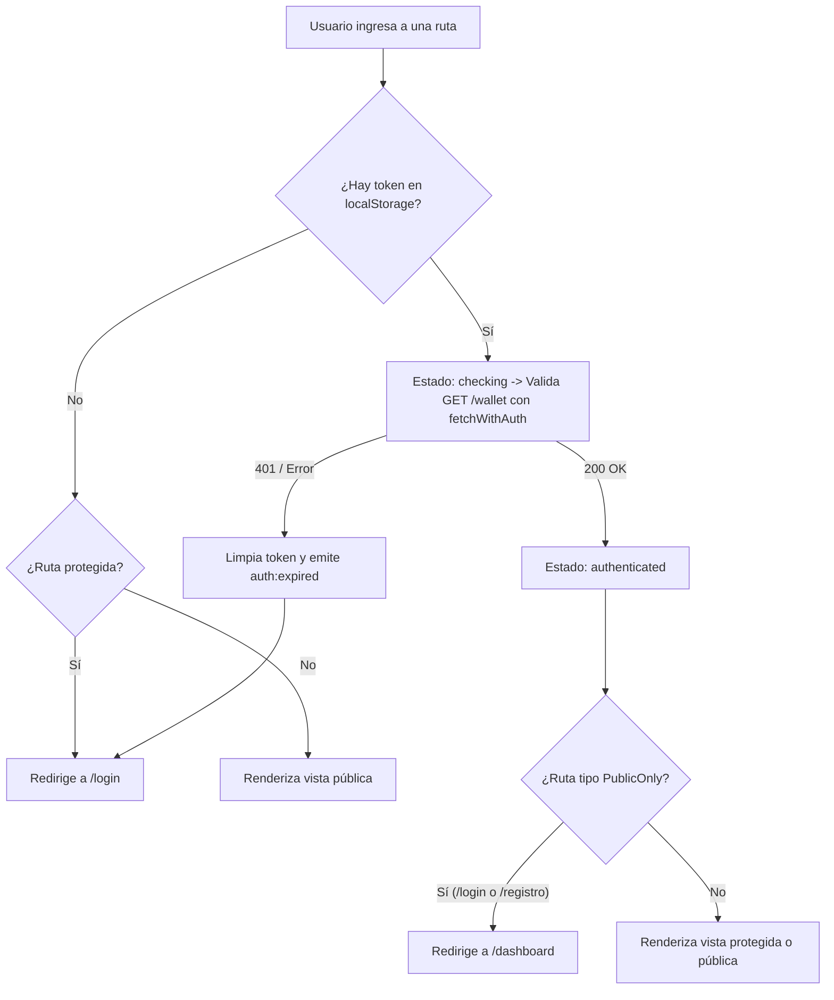

# AXORA — Frontend

Aplicación web moderna (SPA) para **AXORA**, la billetera digital multi-moneda diseñada para viajeros, mochileros y nómadas digitales. Permite gestionar saldos en múltiples divisas (USD, EUR, ARS, COP, MXN, BRL), transferir fondos al instante entre usuarios, realizar intercambios de divisas en tiempo real, visualizar cotizaciones interactivas y operar mediante un asistente virtual con inteligencia artificial (**Google Gemini**).

Construido con **React 19**, **TypeScript**, **Vite** y **React Router DOM v7**, siguiendo principios de **Clean Architecture**, separación estricta de responsabilidades, componentes accesibles y consumo seguro de la API REST (`axora-backend`).

---

## 📋 Tabla de Contenidos

1. [Características Principales](#-características-principales)
2. [Arquitectura del Proyecto](#-arquitectura-del-proyecto)
3. [Descripción de las Capas](#-descripción-de-las-capas)
4. [Ciclo de Vida de la Autenticación y Guardas](#-ciclo-de-vida-de-la-autenticación-y-guardas)
5. [Rutas de la Aplicación](#-rutas-de-la-aplicación)
6. [Componentes y Módulos Destacados](#-componentes-y-módulos-destacados)
7. [Requisitos e Instalación](#-requisitos-e-instalación)
8. [Variables de Entorno](#-variables-de-entorno)
9. [Scripts Disponibles](#-scripts-disponibles)
10. [Estrategia de Pruebas](#-estrategia-de-pruebas)

---

## ✨ Características Principales

- **Gestión Multi-moneda**: Visualización de saldos segregados por divisa con banderas oficiales de países (`react-country-flag`) y cálculo consolidado del patrimonio total en USD.
- **Operaciones Financieras**:
  - **Carga de Fondos (`/topup`)**: Carga de saldo por divisa con validación de límite patrimonial en tiempo real.
  - **Transferencias Inmediatas (`/transfer`)**: Envío de dinero entre usuarios mediante nombre de usuario (`@username`), con control de topes y saldo suficiente.
  - **Intercambio de Monedas (`/exchange`)**: Conversión (*swap*) entre divisas con cotización de mercado en tiempo real y desglose transparente de comisiones (0.3%).
  - **Historial Completo (`/historial`)**: Auditoría cronológica de transacciones con filtros por tipo de operación, contrapartes y detalles técnicos.
- **Gráfico Histórico de Divisas (`CurrencyHistoryChart`)**: Visualización interactiva del valor de USD frente a monedas locales con **ApexCharts** y filtros temporales de 7, 30 y 90 días.
- **Asistente Virtual con IA (`ChatWidget`)**:
  - Chat flotante interactivo potenciado por **Google Gemini 3.5 Flash Lite**.
  - Reconocimiento de lenguaje natural con *Function Calling*.
  - Proposición interactiva de operaciones (transferencias, recargas, intercambios) y botones de confirmación o cancelación en un solo clic.
- **Seguridad y Accesibilidad**:
  - Modo privacidad en el dashboard (ocultar/mostrar balances sensibles).
  - Guardas de ruta bidireccionales (`ProtectedRoute` y `PublicOnlyRoute`).
  - Interceptor HTTP que captura respuestas `401 Unauthorized` y redirige a login tras expirar el token.
  - Campos de contraseña accesibles con toggle de visibilidad (`PasswordInput`).

---

## 🏛️ Arquitectura del Proyecto

El código está estructurado en capas desacopladas que favorecen la mantenibilidad, escalabilidad y testabilidad:

```
src/
├── types/                           # 1. Capa de Modelos y Tipos TypeScript
│   ├── auth.ts                      # Interfaces de usuario, credenciales y autenticación
│   ├── wallet.ts                    # Interfaces de billetera, balances y transacciones
│   ├── rates.ts                     # Interfaces de histórico de tasas de cambio
│   └── chat.ts                      # Interfaces de mensajes, acciones y respuestas del asistente IA
│
├── utils/                           # 2. Capa de Utilidades Puras y Formateadores
│   ├── currency.ts                  # Mapeo de divisas a códigos ISO de país para banderas
│   ├── currency.test.ts             # Pruebas unitarias de mapeo de divisas
│   ├── formatters.ts                # Formateador universal numérico (0,00)
│   └── formatters.test.ts           # Pruebas unitarias de formateo
│
├── api/                             # 3. Capa de Servicios y Clientes de Red
│   ├── fetchWithAuth.ts             # Cliente HTTP base con inyección de Bearer y manejo de 401
│   ├── fetchWithAuth.test.ts        # Pruebas unitarias del interceptor
│   ├── auth.api.ts                  # Servicios de autenticación (loginApi, registerApi)
│   ├── wallet.api.ts                # Servicios de billetera (balances, topup, transfer, exchange)
│   ├── wallet.api.test.ts           # Pruebas unitarias del cliente de wallet
│   ├── rates.api.ts                 # Servicio de consulta de cotizaciones históricas
│   ├── chat.api.ts                  # Servicios del asistente virtual y confirmación de operaciones
│   └── chat.api.test.ts             # Pruebas unitarias de la API de chat
│
├── context/                         # 4. Capa de Estado Global
│   ├── authContext.ts               # Definición del contexto y tipos de sesión
│   └── AuthContext.tsx              # Proveedor de autenticación con validación contra backend
│
├── hooks/                           # 5. Capa de Lógica de Negocio (Custom Hooks)
│   ├── useAuth.ts                   # Consumidor seguro del contexto de autenticación
│   └── useWallet.ts                 # Hook para carga reactiva de balances, transacciones y total USD
│
├── components/                      # 6. Capa de Componentes Reutilizables
│   ├── common/
│   │   └── PasswordInput.tsx        # Campo de contraseña accesible con toggle Eye/EyeOff
│   ├── dashboard/
│   │   ├── AssetCard.tsx            # Tarjeta de activo individual con bandera y saldo
│   │   ├── CurrencyHistoryChart.tsx # Gráfico interactivo de tasas con ApexCharts
│   │   ├── CurrencyHistoryChart.css # Estilos visuales del gráfico
│   │   └── CurrencyHistoryChart.test.tsx # Pruebas unitarias del gráfico
│   └── chat/
│       ├── ChatWidget.tsx           # Widget flotante del asistente de IA
│       ├── ChatWidget.css           # Estilos y animaciones del chat
│       └── ChatWidget.test.tsx      # Pruebas unitarias del asistente conversacional
│
├── routes/                          # 7. Capa de Enrutamiento y Guardas
│   ├── ProtectedRoute.tsx           # Guarda que exige sesión activa
│   ├── ProtectedRoute.test.tsx      # Pruebas de protección de rutas privadas
│   └── PublicOnlyRoute.tsx          # Guarda que redirige al Dashboard si ya hay sesión
│
└── pages/                           # 8. Capa de Vistas / Páginas
    ├── dashboard/                   # Panel principal (resumen patrimonial, activos, accesos directos)
    ├── topup/                       # Carga de saldo a la billetera
    ├── transfer/                    # Transferencias entre usuarios
    ├── exchange/                    # Conversión / swap entre divisas
    ├── historial/                   # Historial completo de movimientos con filtros
    ├── configuracion/               # Perfil de usuario y datos de cuenta
    ├── login/                       # Inicio de sesión
    ├── registro/                    # Alta de cuenta con validaciones de contraseña en vivo
    └── not-found/                   # Vista de error 404
```

---

## ⚙️ Descripción de las Capas

### 1. Modelos y Tipos (`src/types/`)
Contratos TypeScript estrictos y centralizados que garantizan consistencia en toda la aplicación:
- `auth.ts`: `User`, `StoredUser`, `LoginCredentials`, `RegisterData`.
- `wallet.ts`: `Balance`, `WalletResponse`, `Transaction`, `TransactionType`.
- `rates.ts`: `RateHistoryPoint`, `RateHistoryRange`, `RateHistoryResponse`.
- `chat.ts`: `ChatMessage`, `ChatHistoryEntry`, `ProposedAction`, `ChatResponse`, `ChatConfirmResponse`.

### 2. Utilidades Puras (`src/utils/`)
Funciones sin efectos secundarios ni dependencias del framework:
- **`formatAmount`**: Normaliza cualquier representación numérica o decimal a formato legible (`1.500,00`).
- **`getCountryCode` / `CURRENCY_TO_COUNTRY`**: Mapea códigos de divisa ISO a códigos de país (USD → US, EUR → EU, ARS → AR, COP → CO, MXN → MX, BRL → BR).

### 3. Servicios de Red (`src/api/`)
Aísla las peticiones HTTP fuera del ciclo de vida de los componentes:
- `fetchWithAuth`: Agrega `Authorization: Bearer <token>`, intercepta respuestas `401`, limpia el almacenamiento local y notifica mediante el evento personalizado `auth:expired`.
- `auth.api.ts`, `wallet.api.ts`, `rates.api.ts`, `chat.api.ts`: Clientes con tipado estricto y manejo de errores.

### 4. Estado Global y Hooks (`src/context/` & `src/hooks/`)
- **`AuthProvider`**: Valida y restaura la sesión al inicializar o recargar la página.
- **`useWallet`**: Orquesta la carga en paralelo de balances y transacciones recientes, gestiona estados de carga/error y recalcula el patrimonio consolidado.

### 5. Componentes (`src/components/`)
Módulos atómicos, testeados y reutilizables:
- `PasswordInput`: Input con soporte de teclado y accesibilidad ARIA.
- `AssetCard`: Tarjeta de divisa con símbolo y bandera oficial.
- `CurrencyHistoryChart`: Gráfico de área reactivo con selector de par cambiario y rango (7d, 30d, 90d).
- `ChatWidget`: Ventana conversacional de IA con indicador de escritura (*typing indicator*), renderizado de negritas y tarjetas de acción con confirmación.

---

## 🔐 Ciclo de Vida de la Autenticación y Guardas



- **`ProtectedRoute`**: Exige sesión activa; muestra un indicador de carga mientras valida el token y bloquea el acceso redirigiendo a `/login` si no está autenticado.
- **`PublicOnlyRoute`**: Protege rutas exclusivas para usuarios anónimos (como `/login` o `/registro`), redirigiendo a usuarios ya autenticados a `/dashboard`.

---

## 🧭 Rutas de la Aplicación

| Ruta | Componente | Tipo de Acceso | Descripción |
| :--- | :--- | :---: | :--- |
| `/` | `App` | **Público** | Landing page informativa de la plataforma. |
| `/login` | `LoginPage` | **Solo No Autenticado** | Inicio de sesión con validación de credenciales. |
| `/registro` | `RegistroPage` | **Solo No Autenticado** | Formulario de alta con validación de coincidencia de contraseña en tiempo real. |
| `/dashboard` | `DashboardPage` | **Protegido** | Panel principal con resumen de saldos, gráfico de divisas, accesos rápidos y widget de IA. |
| `/topup` | `TopUpPage` | **Protegido** | Carga de saldo a la billetera en cualquiera de las divisas soportadas. |
| `/transfer` | `TransferPage` | **Protegido** | Envío de dinero a otro usuario AXORA mediante su nombre de usuario. |
| `/exchange` | `ExchangePage` | **Protegido** | Conversión instantánea entre monedas con cotización y comisión del 0.3%. |
| `/historial` | `HistorialPage` | **Protegido** | Histórico general de transacciones con filtros y detalles de contrapartes. |
| `/configuracion` | `ConfiguracionPage` | **Protegido** | Perfil de usuario, detalles de cuenta y cierre de sesión. |
| `*` | `NotFoundPage` | **Público** | Página de error 404 con enlace de retorno al inicio. |

---

## 💡 Componentes y Módulos Destacados

### Widget de Asistente Virtual (`ChatWidget`)
Integrado en el Dashboard, permite al usuario interactuar mediante texto natural. Cuando el modelo Gemini identifica una intención financiera, emite un bloque de confirmación en la conversación:
- `propose_transfer`: Prepara los datos del destinatario, divisa e importe.
- `propose_topup`: Prepara una recarga rápida.
- `propose_exchange`: Prepara un swap de monedas.
Al pulsar **Confirmar**, se envía la solicitud al backend (`/chat/confirm`), se ejecuta la transacción y se refrescan automáticamente los balances del usuario.

### Gráfico de Tendencia Cambiaria (`CurrencyHistoryChart`)
Renderiza gráficos de área suaves con **ApexCharts**, permitiendo evaluar la fluctuación de 1 USD frente a monedas latinoamericanas y el Euro en períodos de 7, 30 y 90 días, sincronizado con la API de Frankfurter.

---

## 🛠️ Requisitos e Instalación

### Requisitos previos:
- **Node.js**: v18.0.0 o superior (recomendado v20+).
- **npm**: v9.0.0 o superior.

### Instalación:

```bash
# 1. Clonar el repositorio
git clone https://github.com/axoratechgroup/axora-frontend.git
cd axora-frontend

# 2. Instalar paquetes
npm install

# 3. Configurar entorno
cp .env.example .env
```

---

## 🔑 Variables de Entorno

Configura el archivo `.env` en la raíz del proyecto:

| Variable | Obligatoria | Descripción | Ejemplo |
| :--- | :---: | :--- | :--- |
| `VITE_API_URL` | **Sí** | URL base del servidor backend de AXORA | `http://localhost:3000` *(local)* o `https://axora-backend-production-4e8d.up.railway.app` |

---

## 🚀 Scripts Disponibles

```bash
# Iniciar servidor de desarrollo en http://localhost:5173
npm run dev

# Compilar tipos y generar bundle optimizado para producción
npm run build

# Previsualizar el bundle de producción localmente
npm run preview

# Ejecutar el linter ESLint
npm run lint

# Ejecutar suite de pruebas unitarias y de integración (Vitest)
npm run test:run

# Ejecutar pruebas en modo interactivo/vigilancia (watch)
npm test
```

---

## 🧪 Estrategia de Pruebas

Toda la aplicación está cubierta por pruebas unitarias y de integración con **Vitest** y **React Testing Library** (17 suites de pruebas, 72 pruebas en total):

- **Páginas y Flujos de Usuario**:
  - `DashboardPage.test.tsx`: Resumen de saldos, ocultamiento por privacidad y cierre de sesión.
  - `TransferPage.test.tsx`: Validaciones de montos, selección de moneda y envío de transferencias.
  - `ExchangePage.test.tsx`: Cálculo de conversión, advertencias de moneda idéntica e intercambio.
  - `TopUpPage.test.tsx`: Cargas de saldo y validaciones de importes mínimos.
  - `HistorialPage.test.tsx`: Renderizado cronológico y detalle de estados.
  - `ConfiguracionPage.test.tsx`: Renderizado del perfil y cierre de sesión.
  - `LoginPage.test.tsx`: Validación de campos, visibilidad de clave y navegación.
  - `RegistroPage.test.tsx`: Validación de coincidencia de contraseña y envío de formulario.
  - `NotFoundPage.test.tsx`: Manejo de rutas inexistentes y navegación.
- **Componentes**:
  - `ChatWidget.test.tsx`: Apertura del chat, envío de mensajes, estados de carga y confirmación/cancelación de acciones propuestas.
  - `CurrencyHistoryChart.test.tsx`: Renderizado de cotizaciones, alternancia de rangos y manejo de errores.
  - `ProtectedRoute.test.tsx`: Protección contra accesos no autenticados y estados de verificación.
- **Servicios de Red & Interceptores**:
  - `fetchWithAuth.test.ts`: Inyección de cabeceras Bearer, captura de 401 y disparo de eventos.
  - `wallet.api.test.ts`: Consumo tipado de endpoints de billetera.
  - `chat.api.test.ts`: Envío de mensajes y confirmaciones de acciones.
- **Utilidades**:
  - `formatters.test.ts` & `currency.test.ts`: Formato decimal con coma y mapeo de banderas por país.
