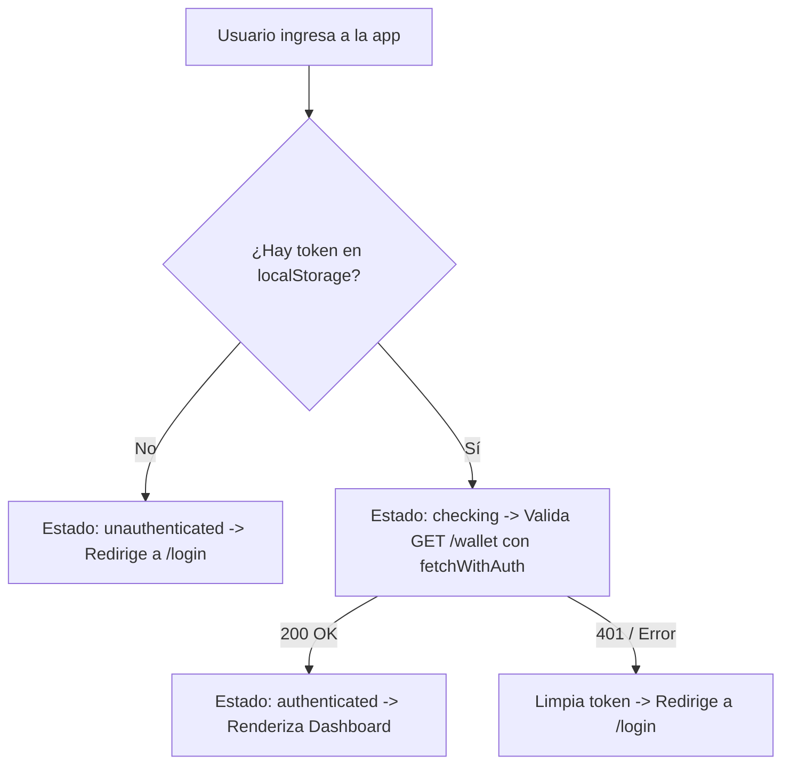

# AXORA — Frontend

Billetera multi-moneda para mochileros y nómadas digitales. Permite gestionar saldos en diversas divisas, realizar seguimiento de activos con banderas oficiales en tiempo real, autenticación persistente y visualización de historial de transacciones.

Construido con **React 19 + TypeScript + Vite**, siguiendo principios de **Clean Architecture**, alta modularización y consumo de API REST del backend (`axora-backend`, Express + PostgreSQL en Railway).

---

## 🏛️ Arquitectura del Proyecto.

El frontend sigue una arquitectura modular y desacoplada por capas de responsabilidad clara:

```
src/
├── types/                     # 1. Capa de Modelos y Tipos TypeScript
│   ├── auth.ts                # Interfaces de usuario, credenciales y autenticación
│   └── wallet.ts              # Interfaces de billetera, balances y transacciones
│
├── utils/                     # 2. Capa de Utilidades Puras y Formateadores
│   ├── currency.ts            # Mapeo de monedas a códigos de país ISO 3166-1 alpha-2
│   ├── currency.test.ts       # Pruebas unitarias de mapeo de divisas
│   ├── formatters.ts          # Formateador universal de saldos a 2 decimales (0,00)
│   └── formatters.test.ts     # Pruebas unitarias de formateo
│
├── api/                       # 3. Capa de Servicios y Clientes de Red
│   ├── fetchWithAuth.ts       # Cliente HTTP base con inyección de Bearer y manejo de 401
│   ├── fetchWithAuth.test.ts  # Pruebas unitarias del interceptor de autenticación
│   ├── auth.api.ts            # Servicios de autenticación (loginApi, registerApi)
│   └── wallet.api.ts          # Servicios de wallet (getWalletApi, getWalletTransactionsApi)
│
├── context/                   # 4. Capa de Estado Global
│   ├── authContext.ts         # Definición del contexto y tipos de estado de sesión
│   └── AuthContext.tsx        # Provider con validación de sesión contra el backend
│
├── hooks/                     # 5. Capa de Lógica de Negocio (Custom Hooks)
│   ├── useAuth.ts             # Hook consumidor del contexto de autenticación
│   └── useWallet.ts           # Hook de carga de wallet, transacciones y cálculo reactivo
│
├── components/                # 6. Capa de Componentes Reutilizables
│   ├── common/
│   │   └── PasswordInput.tsx  # Input de contraseña accesible con toggle Eye/EyeOff
│   └── dashboard/
│       └── AssetCard.tsx      # Tarjeta visual de activo con bandera y saldo
│
├── routes/                    # 7. Capa de Enrutamiento y Guardas
│   ├── ProtectedRoute.tsx     # Guarda de rutas que valida sesión activa
│   └── ProtectedRoute.test.tsx# Pruebas unitarias de protección de rutas
│
└── pages/                     # 8. Capa de Vistas / Páginas
    ├── dashboard/             # Panel principal de usuario
    ├── login/                 # Inicio de sesión
    ├── registro/              # Alta de usuario y wallet
    └── not-found/             # Página 404 con ruta wildcard (*)
```

---

## ⚙️ Descripción de las Capas

### 1. Modelos y Tipos (`src/types/`)

Centraliza las interfaces de TypeScript para que los componentes, hooks y servicios de API compartan las mismas definiciones sin duplicación de código (`User`, `StoredUser`, `Balance`, `WalletResponse`, `Transaction`).

### 2. Utilidades Puras (`src/utils/`)

Funciones puras sin dependencias de React:

- **`formatAmount`**: Convierte cualquier valor numérico o string (`0.00000000`, `1504.5`) en formato estándar de presentación con 2 decimales y coma (`0,00`, `1504,50`).
- **`getCountryCode` / `CURRENCY_TO_COUNTRY`**: Asocia monedas a su bandera oficial (`USD` ➔ `US`, `ARS` ➔ `AR`, `COP` ➔ `CO`, `MXN` ➔ `MX`, `EUR` ➔ `EU`, `BRL` ➔ `BR`).

### 3. Servicios de API (`src/api/`)

Aísla las URLs, endpoints y llamadas `fetch` fuera de los componentes.

- `fetchWithAuth`: Interceptor que añade el token `Authorization: Bearer <token>`, detecta respuestas `401 Unauthorized`, limpia la sesión en `localStorage` y emite el evento `auth:expired` para redirigir a `/login`.
- `auth.api.ts` y `wallet.api.ts`: Métodos fuertemente tipados para consultar el backend.

### 4. Custom Hooks (`src/hooks/`)

Encapsulan el ciclo de vida, estados asíncronos y lógica de negocio:

- **`useWallet`**: Controla la carga en paralelo de balances y transacciones recientes, gestiona estados de carga (`walletLoading`, `transactionsLoading`), errores y calcula reactivamente `totalBalance`.
- **`useAuth`**: Proporciona el estado de autenticación (`checking`, `authenticated`, `unauthenticated`).

### 5. Componentes Reutilizables (`src/components/`)

Elementos atómicos de interfaz UI:

- **`PasswordInput`**: Campo de contraseña accesible (`aria-label`, foco por teclado) con botón para alternar entre `type="password"` y `type="text"`.
- **`AssetCard`**: Renderiza el balance individual junto a la bandera oficial generada con `react-country-flag`.

---

## 🔐 Ciclo de Vida de la Autenticación



1. **Persistencia**: Al recargar la página, `AuthProvider` pasa a estado `checking` y valida el token llamando a `GET /wallet`.
2. **Expiración**: Si el backend responde `401`, `fetchWithAuth` limpia credenciales y emite el evento global `auth:expired`.
3. **Guardas**: `ProtectedRoute` muestra una pantalla de carga mientras valida y bloquea el acceso si no hay sesión válida.

---

## 🧭 Rutas de la Aplicación

| Ruta         | Componente      | Acceso        | Descripción                                          |
| :----------- | :-------------- | :------------ | :--------------------------------------------------- |
| `/`          | `App`           | Público       | Landing page informativa                             |
| `/login`     | `LoginPage`     | Público       | Inicio de sesión con toggle de contraseña            |
| `/registro`  | `RegistroPage`  | Público       | Registro de usuario, validación de contraseñas       |
| `/dashboard` | `DashboardPage` | **Protegido** | Resumen de cuenta, activos, transacciones y gráficas |
| `*`          | `NotFoundPage`  | Público       | Página 404 con gatito decorativo y botón al inicio   |

---

## 🛠️ Requisitos e Instalación

### Requisitos previos:

- Node.js (v18 o superior)
- npm

### Configuración:

```bash
# 1. Instalar dependencias
npm install

# 2. Configurar variables de entorno
cp .env.example .env
```

| Variable       | Descripción                    | Ejemplo                                                |
| :------------- | :----------------------------- | :----------------------------------------------------- |
| `VITE_API_URL` | URL base del backend (Express) | `https://axora-backend-production-4e8d.up.railway.app` |

---

## 🚀 Scripts Disponibles

```bash
# Servidor de desarrollo
npm run dev

# Compilación y bundle de producción
npm run build

# Vista previa del build local
npm run preview

# Ejecutar suite de pruebas unitarias (Vitest)
npm run test:run

# Modo interactivo de pruebas (Watch)
npm run test

# Análisis de código estático (ESLint)
npm run lint
```

---

## 🧪 Estrategia de Pruebas

Toda la aplicación cuenta con pruebas automatizadas usando **Vitest** y **React Testing Library**:

- **`fetchWithAuth.test.ts`**: Interceptores de autenticación y manejo de errores 401.
- **`ProtectedRoute.test.tsx`**: Protección de rutas y redirecciones.
- **`DashboardPage.test.tsx`**: Renderizado de saldos, ocultar/mostrar y cierre de sesión.
- **`LoginPage.test.tsx`**: Validación de formulario, login exitoso y visibilidad de contraseña.
- **`RegistroPage.test.tsx`**: Validación en vivo, coincidencia de contraseñas y registro.
- **`NotFoundPage.test.tsx`**: Ruta comodín y navegación al inicio.
- **`formatters.test.ts` & `currency.test.ts`**: Pruebas unitarias de utilidades y formateo numérico.
